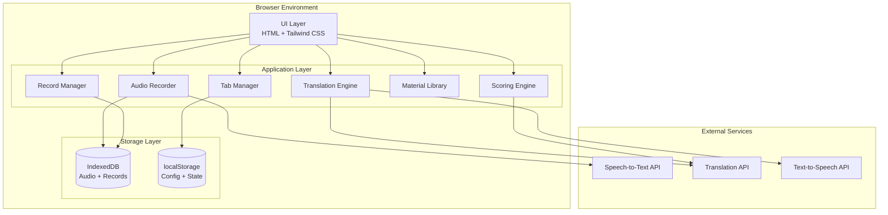
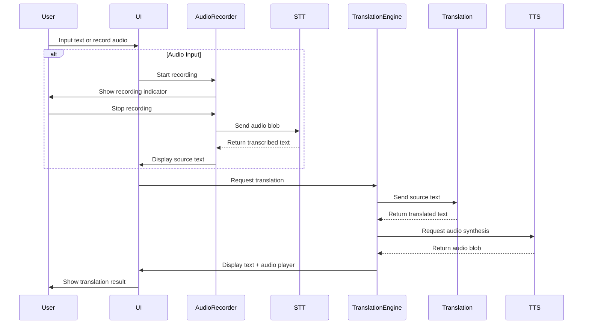
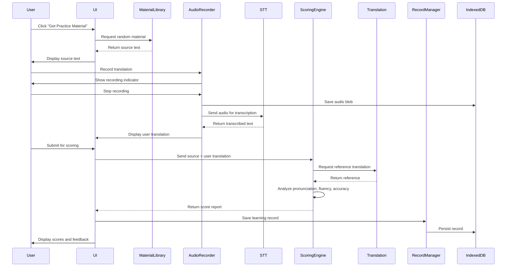

# Design Document: AI 口译训练平台

## Overview

AI 口译训练平台是一个纯前端的 Web 应用，采用 HTML + Tailwind CSS + Vanilla JavaScript 技术栈构建。该平台通过集成第三方 API 服务（语音识别、AI 翻译、语音合成）提供完整的口译训练功能，使用浏览器本地存储（IndexedDB）管理用户数据和学习记录。

### 核心设计原则

1. **前端优先架构** - 无需后端服务器，所有逻辑在浏览器中执行
2. **API 驱动** - 通过第三方 API 实现核心 AI 功能（STT、翻译、TTS）
3. **本地数据持久化** - 使用 IndexedDB 存储音频和学习记录
4. **模块化设计** - 清晰的组件边界和职责分离
5. **响应式体验** - 适配桌面、平板和移动设备

### 技术栈选型

**前端框架**
- HTML5 - 语义化标记和现代 Web API
- Tailwind CSS - 实用优先的 CSS 框架
- Vanilla JavaScript (ES6+) - 无框架依赖，轻量高效

**浏览器 API**
- MediaRecorder API - 音频录制
- IndexedDB API - 大容量本地存储
- Fetch API - HTTP 请求处理

**第三方服务集成**
- Speech-to-Text (STT) - 语音转文字（推荐：OpenAI Whisper API）
- AI Translation - 中英文双向翻译（推荐：DeepL API）
- Text-to-Speech (TTS) - 文字转语音（推荐：OpenAI TTS API）

### 设计目标

- **性能**: 初始加载 < 3秒，交互响应 < 500ms
- **可靠性**: 优雅的错误处理和降级策略
- **可维护性**: 模块化架构，清晰的代码组织
- **可扩展性**: 易于添加新功能和集成新服务
- **用户体验**: 直观的界面，流畅的交互，及时的反馈


## Architecture

### System Architecture

系统采用分层架构，从上到下分为：UI 层、应用层、存储层和外部服务层。




**架构说明**:

1. **UI Layer**: 负责用户界面渲染和用户交互，使用 HTML + Tailwind CSS 构建
2. **Application Layer**: 包含核心业务逻辑组件，每个组件负责特定功能域
3. **Storage Layer**: 管理本地数据持久化，IndexedDB 存储大文件，localStorage 存储配置
4. **External Services**: 第三方 API 服务，通过 Service 层封装访问


### Data Flow Diagrams

#### Demo Mode Flow

用户输入英文（文本或语音）→ 获取 AI 翻译 → 显示中文翻译（文本 + 音频）




#### Practice Mode Flow

用户获取练习素材 → 录音翻译 → 提交评分 → 查看评分报告 → 保存学习记录




### Component Architecture

应用采用模块化组件架构，文件组织如下：

```
src/
├── index.html              # Main HTML entry point
├── styles/
│   └── main.css           # Tailwind CSS configuration
├── js/
│   ├── main.js            # Application initialization
│   ├── components/
│   │   ├── TabManager.js      # Tab navigation controller
│   │   ├── AudioRecorder.js   # Audio recording component
│   │   ├── TranslationEngine.js # Translation orchestrator
│   │   ├── ScoringEngine.js   # Multi-dimensional scoring
│   │   ├── MaterialLibrary.js # Practice material manager
│   │   └── RecordManager.js   # Learning record CRUD
│   ├── services/
│   │   ├── STTService.js      # Speech-to-Text API wrapper
│   │   ├── TranslationService.js # Translation API wrapper
│   │   └── TTSService.js      # Text-to-Speech API wrapper
│   ├── storage/
│   │   ├── IndexedDBManager.js # IndexedDB operations
│   │   └── LocalStorageManager.js # localStorage operations
│   └── utils/
│       ├── ErrorHandler.js    # Centralized error handling
│       ├── LoadingIndicator.js # Loading state management
│       └── Validator.js       # Input validation utilities
└── data/
    └── materials.json     # Default practice materials (20+ items)
```

**组件职责划分**:

- **Components**: 业务逻辑组件，处理特定功能域
- **Services**: API 服务封装，统一外部服务访问接口
- **Storage**: 数据持久化管理，封装存储操作
- **Utils**: 通用工具函数，提供跨组件复用能力


## Components and Interfaces


### 1. TabManager Component

**职责**: 管理标签页导航和视图切换（Demo Mode、Practice Mode、Learning Records）

**接口定义**:
```javascript
class TabManager {
  constructor(containerElement)
  
  // Switch to specified tab
  switchTab(tabName: 'demo' | 'practice' | 'records'): void
  
  // Get current active tab
  getCurrentTab(): string
  
  // Register tab change listener
  onTabChange(callback: (tabName: string) => void): void
  
  // Preserve tab state when switching
  saveTabState(tabName: string, state: object): void
  getTabState(tabName: string): object
}
```

**核心功能**:
- 维护活动标签状态（localStorage 持久化）
- 切换标签时保留输入数据（满足 Requirement 12.5）
- 提供视觉反馈显示当前活动标签（满足 Requirement 12.4）
- 支持键盘导航（Tab 键）（满足 Requirement 17.2）
- 标签切换响应时间 < 500ms（满足 Requirement 15.2）

**实现细节**:
- 使用事件委托处理标签点击
- CSS 类切换实现视图显示/隐藏
- localStorage 键: `active_tab`, `tab_state_demo`, `tab_state_practice`


### 2. AudioRecorder Component

**职责**: 处理麦克风访问、音频录制和播放功能

**接口定义**:
```javascript
class AudioRecorder {
  constructor()
  
  // Request microphone permission
  async requestPermission(): Promise<boolean>
  
  // Start recording audio
  async startRecording(): Promise<void>
  
  // Stop recording and return audio blob
  async stopRecording(): Promise<Blob>
  
  // Get recording duration in seconds
  getDuration(): number
  
  // Check if currently recording
  isRecording(): boolean
  
  // Create audio player element for playback
  createAudioPlayer(audioBlob: Blob): HTMLAudioElement
  
  // Register recording state change listener
  onRecordingStateChange(callback: (isRecording: boolean) => void): void
}
```

**核心功能**:
- 请求麦克风权限（满足 Requirement 3.2）
- 录制音频（1-120秒）（满足 Requirement 3.6）
- 显示录制指示器（脉冲图标 + 计时器）（满足 Requirement 3.3）
- 保存音频为 WAV/MP3 格式（满足 Requirement 3.5）
- 支持重新录制（满足 Requirement 3.8）
- 权限拒绝时显示错误消息（满足 Requirement 3.7）

**实现细节**:
- 使用 MediaRecorder API，格式: `audio/webm` 或 `audio/mp4`
- 录制状态管理: idle → recording → stopped
- 音频 blob 存储到 IndexedDB
- 提供音频播放器控件


### 3. TranslationEngine Component

**职责**: 协调翻译工作流，包括翻译 API 调用和 TTS 生成

**接口定义**:
```javascript
class TranslationEngine {
  constructor(translationService, ttsService)
  
  // Translate text from source to target language
  async translate(sourceText: string, sourceLanguage: string, targetLanguage: string): Promise<TranslationResult>
  
  // Generate audio for translated text
  async synthesizeSpeech(text: string, language: string): Promise<Blob>
  
  // Get supported language pairs
  getSupportedLanguages(): Array<{code: string, name: string}>
  
  // Set current language direction
  setLanguageDirection(direction: 'en-zh' | 'zh-en'): void
  
  // Get current language direction
  getLanguageDirection(): string
}

interface TranslationResult {
  sourceText: string
  translatedText: string
  sourceLanguage: string
  targetLanguage: string
  audioBlob?: Blob
  timestamp: number
}
```

**核心功能**:
- 执行中英文双向翻译（满足 Requirement 1.1, 2.4）
- 生成翻译音频（满足 Requirement 2.6）
- 管理语言方向切换（满足 Requirement 1.2, 1.3）
- 翻译时间 < 10秒（满足 Requirement 2.4, 15.4）
- TTS 生成时间 < 3秒（满足 Requirement 2.6, 15.5）
- 翻译失败时显示错误（满足 Requirement 2.9）

**实现细节**:
- 集成 DeepL API 或 OpenAI Translation
- 集成 OpenAI TTS API 生成音频
- 缓存最近翻译结果减少 API 调用
- 处理 API 限流和重试逻辑
- 支持 en-zh 和 zh-en 两个方向


### 4. ScoringEngine Component

**职责**: 对用户翻译进行多维度评分（发音、流畅性、准确性）

**接口定义**:
```javascript
class ScoringEngine {
  constructor(translationService)
  
  // Evaluate user translation and generate score report
  async evaluateTranslation(sourceText: string, userTranslation: string, userAudio: Blob): Promise<ScoreReport>
  
  // Analyze pronunciation quality
  analyzePronunciation(recognizedText: string, referenceText: string): PronunciationScore
  
  // Analyze fluency quality
  analyzeFluency(recognizedText: string): FluencyScore
  
  // Analyze translation accuracy
  analyzeAccuracy(sourceText: string, userTranslation: string, referenceTranslation: string): AccuracyScore
}

interface ScoreReport {
  pronunciationScore: number  // 0-3
  fluencyScore: number        // 0-3
  accuracyScore: number       // 0-3
  totalScore: number          // 0-9
  pronunciationFeedback: string
  fluencyFeedback: string
  accuracyFeedback: string
  timestamp: number
}

interface PronunciationScore {
  score: number
  homophoneErrors: Array<{detected: string, expected: string}>
  syllableIssues: Array<string>
}

interface FluencyScore {
  score: number
  repeatedWords: Array<string>
  fillerWords: Array<string>
  unnaturalPauses: number
}

interface AccuracyScore {
  score: number
  missingKeyInfo: Array<string>
  addedInfo: Array<string>
  mistranslations: Array<{source: string, user: string, expected: string}>
}
```


**评分算法**:

1. **发音评分** (0-3分) - 满足 Requirement 7:
   - 分析 STT 输出中的同音错字
   - 检测缺失或多余的音节
   - 评分标准:
     - 3分: 无发音错误
     - 2分: 1-2个同音错字
     - 1分: 3-4个同音错字
     - 0分: 5个以上同音错字
   - 提供具体错误示例（满足 Requirement 7.8）

2. **流畅性评分** (0-3分) - 满足 Requirement 8:
   - 检测重复词语（"我我我"、"那个那个"）
   - 识别填充词（"嗯"、"啊"、"额"）
   - 统计不自然停顿（过多标点符号）
   - 评分标准:
     - 3分: 流畅无停顿
     - 2分: 1-2处犹豫标记
     - 1分: 3-4处犹豫标记
     - 0分: 5处以上犹豫标记
   - 提供具体流畅性问题示例（满足 Requirement 8.9）

3. **准确性评分** (0-3分) - 满足 Requirement 9:
   - 对比用户翻译与参考翻译
   - 识别缺失的关键信息
   - 检测添加的额外信息
   - 标记误译概念
   - 评分标准:
     - 3分: 所有关键信息正确
     - 2分: 轻微遗漏/添加，不影响核心意思
     - 1分: 显著遗漏/误译，影响核心意思
     - 0分: 大部分错误或无法理解
   - 提供具体准确性问题示例（满足 Requirement 9.9）

**核心功能**:
- 三维度评分（满足 Requirement 6.1-6.6）
- 评分时间 < 15秒（满足 Requirement 6.7, 15.6）
- 结构化评分报告（满足 Requirement 6.8）
- 雷达图可视化（满足 Requirement 6.9）


### 5. MaterialLibrary Component

**职责**: 管理练习素材，提供随机素材选择

**接口定义**:
```javascript
class MaterialLibrary {
  constructor(materials)
  
  // Get a random practice material
  getRandomMaterial(excludeRecent: boolean = true): PracticeMaterial
  
  // Get material by ID
  getMaterialById(id: string): PracticeMaterial
  
  // Get materials by difficulty level
  getMaterialsByDifficulty(level: 'easy' | 'medium' | 'hard'): Array<PracticeMaterial>
  
  // Get materials by topic category
  getMaterialsByTopic(topic: string): Array<PracticeMaterial>
  
  // Add new material
  addMaterial(material: PracticeMaterial): void
  
  // Track recently used materials
  markAsUsed(materialId: string): void
}

interface PracticeMaterial {
  id: string
  sourceText: string
  referenceTranslation: string
  difficultyLevel: 'easy' | 'medium' | 'hard'
  topicCategory: string
  wordCount: number
  createdAt: number
}
```

**核心功能**:
- 从 JSON 加载默认素材（满足 Requirement 5.1, 5.2）
- 随机返回素材 < 1秒（满足 Requirement 5.3）
- 素材结构包含必要字段（满足 Requirement 5.4）
- 10次内不重复（满足 Requirement 5.5）
- 支持难度和主题筛选

**实现细节**:
- 从 `data/materials.json` 加载至少 20 条素材
- 维护最近使用队列（最后 10 条）
- 使用 localStorage 存储使用历史
- 支持按难度和主题分类


### 6. RecordManager Component

**职责**: 管理学习记录的 CRUD 操作

**接口定义**:
```javascript
class RecordManager {
  constructor(indexedDBManager)
  
  // Save a new learning record
  async saveRecord(record: LearningRecord): Promise<string>
  
  // Get all learning records
  async getAllRecords(): Promise<Array<LearningRecord>>
  
  // Get records with pagination
  async getRecordsPaginated(page: number, pageSize: number): Promise<PaginatedRecords>
  
  // Get record by ID
  async getRecordById(id: string): Promise<LearningRecord>
  
  // Delete record by ID
  async deleteRecord(id: string): Promise<void>
  
  // Get statistics summary
  async getStatistics(): Promise<RecordStatistics>
  
  // Export records as CSV
  async exportToCSV(): Promise<string>
}

interface LearningRecord {
  id: string
  timestamp: number
  sourceText: string
  userTranslation: string
  userAudioBlobId: string
  pronunciationScore: number
  fluencyScore: number
  accuracyScore: number
  totalScore: number
  pronunciationFeedback: string
  fluencyFeedback: string
  accuracyFeedback: string
  languageDirection: string
}

interface RecordStatistics {
  totalSessions: number
  averageScore: number
  averagePronunciation: number
  averageFluency: number
  averageAccuracy: number
  scoresTrend: Array<{date: string, score: number}>
}
```

**核心功能**:
- 保存学习记录（满足 Requirement 10.1-10.5）
- 查询所有记录（满足 Requirement 11.2）
- 表格展示记录（满足 Requirement 11.3）
- 时间倒序排序（满足 Requirement 11.4）
- 查看详细信息（满足 Requirement 11.5）
- 统计摘要（满足 Requirement 11.6）
- 加载时间 < 3秒（满足 Requirement 11.7）
- 空记录提示（满足 Requirement 11.8）
- 删除记录（满足 Requirement 16.3）


### 7. Service Layer Components

#### STTService

**职责**: 封装 Speech-to-Text API 集成

**接口定义**:
```javascript
class STTService {
  constructor(apiKey, apiEndpoint)
  
  // Transcribe audio blob to text
  async transcribe(audioBlob: Blob, language: string): Promise<TranscriptionResult>
  
  // Check service availability
  async healthCheck(): Promise<boolean>
}

interface TranscriptionResult {
  text: string
  confidence: number
  language: string
  duration: number
}
```

**推荐 API**:
- **首选**: OpenAI Whisper API（高准确度，多语言支持）
- **备选**: Google Cloud Speech-to-Text, Azure Speech Services
- **降级**: Web Speech API（浏览器原生，准确度较低）

**核心功能**:
- 音频转文字 < 5秒（满足 Requirement 2.3, 4.5, 15.3）
- 识别失败显示错误（满足 Requirement 2.8）
- 支持中英文识别

#### TranslationService

**职责**: 封装 Translation API 集成

**接口定义**:
```javascript
class TranslationService {
  constructor(apiKey, apiEndpoint)
  
  // Translate text between languages
  async translate(text: string, sourceLang: string, targetLang: string): Promise<string>
  
  // Detect source language
  async detectLanguage(text: string): Promise<string>
  
  // Check service availability
  async healthCheck(): Promise<boolean>
}
```

**推荐 API**:
- **首选**: DeepL API（EN-ZH 翻译准确度最高）
- **备选**: OpenAI GPT-4 Translation, Google Cloud Translation
- **降级**: Google Translate（有免费额度）


#### TTSService

**职责**: 封装 Text-to-Speech API 集成

**接口定义**:
```javascript
class TTSService {
  constructor(apiKey, apiEndpoint)
  
  // Synthesize speech from text
  async synthesize(text: string, language: string, voice?: string): Promise<Blob>
  
  // Get available voices for a language
  async getVoices(language: string): Promise<Array<Voice>>
  
  // Check service availability
  async healthCheck(): Promise<boolean>
}

interface Voice {
  id: string
  name: string
  language: string
  gender: 'male' | 'female' | 'neutral'
}
```

**推荐 API**:
- **首选**: OpenAI TTS API（自然语音质量）
- **备选**: Google Cloud Text-to-Speech, Azure Speech Services
- **降级**: Web Speech API SpeechSynthesis（浏览器原生）

**核心功能**:
- 文字转语音 < 3秒（满足 Requirement 2.6, 15.5）
- 支持中英文语音合成
- 提供多种音色选择


### 8. Storage Layer Components

#### IndexedDBManager

**职责**: 管理 IndexedDB 操作，存储音频和学习记录

**接口定义**:
```javascript
class IndexedDBManager {
  constructor(dbName, version)
  
  // Initialize database
  async init(): Promise<void>
  
  // Store audio blob
  async saveAudioBlob(blob: Blob, metadata: object): Promise<string>
  
  // Retrieve audio blob by ID
  async getAudioBlob(id: string): Promise<Blob>
  
  // Delete audio blob
  async deleteAudioBlob(id: string): Promise<void>
  
  // Store learning record
  async saveRecord(record: LearningRecord): Promise<string>
  
  // Retrieve all records
  async getAllRecords(): Promise<Array<LearningRecord>>
  
  // Delete record
  async deleteRecord(id: string): Promise<void>
  
  // Clear all data
  async clearAll(): Promise<void>
}
```


**数据库架构**:
```javascript
// Object Store: audioBlobs
{
  id: string (primary key)
  blob: Blob
  mimeType: string
  size: number
  createdAt: number
}

// Object Store: learningRecords
{
  id: string (primary key)
  timestamp: number (indexed)
  sourceText: string
  userTranslation: string
  userAudioBlobId: string
  pronunciationScore: number
  fluencyScore: number
  accuracyScore: number
  totalScore: number
  pronunciationFeedback: string
  fluencyFeedback: string
  accuracyFeedback: string
  languageDirection: string
}
```

**核心功能**:
- 存储音频 blob（满足 Requirement 16.1）
- 存储学习记录（满足 Requirement 10.3）
- 保存时间 < 2秒（满足 Requirement 10.5）
- 支持数据删除（满足 Requirement 16.3）

#### LocalStorageManager

**职责**: 管理 localStorage 操作，存储配置和 UI 状态

**接口定义**:
```javascript
class LocalStorageManager {
  // Save configuration
  saveConfig(key: string, value: any): void
  
  // Get configuration
  getConfig(key: string, defaultValue?: any): any
  
  // Save tab state
  saveTabState(tabName: string, state: object): void
  
  // Get tab state
  getTabState(tabName: string): object
  
  // Save language direction
  saveLanguageDirection(direction: string): void
  
  // Get language direction
  getLanguageDirection(): string
  
  // Save recently used materials
  saveRecentMaterials(materialIds: Array<string>): void
  
  // Get recently used materials
  getRecentMaterials(): Array<string>
  
  // Clear all localStorage data
  clearAll(): void
}
```


**存储键定义**:
- `app_config` - 应用配置
- `language_direction` - 当前语言方向（en-zh 或 zh-en）
- `active_tab` - 当前活动标签
- `tab_state_demo` - Demo 模式标签状态
- `tab_state_practice` - Practice 模式标签状态
- `recent_materials` - 最近使用的素材 ID（最后 10 条）

**核心功能**:
- 持久化语言方向（满足 Requirement 1.3）
- 保存标签状态（满足 Requirement 12.5）
- 跟踪素材使用历史（满足 Requirement 5.5）


### 9. Utility Components

#### ErrorHandler

**职责**: 集中式错误处理和用户反馈

**接口定义**:
```javascript
class ErrorHandler {
  // Display error message to user
  static showError(message: string, type: 'network' | 'api' | 'permission' | 'validation', autoDismiss: boolean = true): void
  
  // Log error to console
  static logError(error: Error, context: string): void
  
  // Handle API errors
  static handleAPIError(error: Error, apiName: string): void
  
  // Handle network errors
  static handleNetworkError(error: Error): void
}
```

**核心功能**:
- 显示用户友好错误消息（满足 Requirement 13.1）
- 区分错误类型（满足 Requirement 13.2）
- 提供可操作指导（满足 Requirement 13.3）
- 视觉区分样式（满足 Requirement 13.4）
- 自动消失非关键错误（满足 Requirement 13.5）
- 关键错误需确认（满足 Requirement 13.6）
- 控制台日志记录（满足 Requirement 13.7）
- 错误队列管理（满足 Requirement 13.8）

#### LoadingIndicator

**职责**: 管理加载状态和指示器

**接口定义**:
```javascript
class LoadingIndicator {
  // Show loading indicator
  static show(message?: string): void
  
  // Hide loading indicator
  static hide(): void
  
  // Show loading for specific element
  static showForElement(element: HTMLElement, message?: string): void
  
  // Hide loading for specific element
  static hideForElement(element: HTMLElement): void
}
```

**核心功能**:
- 超过 1秒操作显示加载指示器（满足 Requirement 15.7）
- 全局和局部加载状态
- 防止重复操作


#### Validator

**职责**: 输入验证工具

**接口定义**:
```javascript
class Validator {
  // Validate text input
  static validateText(text: string, minLength: number, maxLength: number): {valid: boolean, error?: string}
  
  // Validate audio blob
  static validateAudio(blob: Blob, minDuration: number, maxDuration: number): {valid: boolean, error?: string}
  
  // Sanitize user input
  static sanitizeInput(input: string): string
}
```

**核心功能**:
- 文本长度验证
- 音频时长验证（1-120秒）
- 输入清理防注入（满足 Requirement 16.5）


## Data Models

### PracticeMaterial

练习素材数据模型

```javascript
{
  id: string,                    // 唯一标识符 (UUID)
  sourceText: string,            // 原文文本
  referenceTranslation: string,  // 参考翻译
  difficultyLevel: 'easy' | 'medium' | 'hard',  // 难度等级
  topicCategory: string,         // 主题分类（如 "business", "technology", "daily"）
  wordCount: number,             // 单词数
  createdAt: number              // 创建时间戳
}
```

**示例**:
```json
{
  "id": "mat_001",
  "sourceText": "The rapid advancement of artificial intelligence is transforming industries worldwide.",
  "referenceTranslation": "人工智能的快速发展正在改变全球各行各业。",
  "difficultyLevel": "medium",
  "topicCategory": "technology",
  "wordCount": 11,
  "createdAt": 1704067200000
}
```

**验证规则**:
- `id`: 必填，唯一
- `sourceText`: 必填，1-500 字符
- `referenceTranslation`: 必填，1-500 字符
- `difficultyLevel`: 必填，枚举值
- `topicCategory`: 必填，字符串
- `wordCount`: 必填，正整数
- `createdAt`: 必填，Unix 时间戳


### LearningRecord

学习记录数据模型

```javascript
{
  id: string,                    // 唯一标识符 (UUID)
  timestamp: number,             // 完成时间戳
  sourceText: string,            // 原文文本
  userTranslation: string,       // 用户翻译（从音频转录）
  userAudioBlobId: string,       // 音频 blob 在 IndexedDB 中的引用
  pronunciationScore: number,    // 发音分数 (0-3)
  fluencyScore: number,          // 流畅性分数 (0-3)
  accuracyScore: number,         // 准确性分数 (0-3)
  totalScore: number,            // 总分 (0-9)
  pronunciationFeedback: string, // 发音详细反馈
  fluencyFeedback: string,       // 流畅性详细反馈
  accuracyFeedback: string,      // 准确性详细反馈
  languageDirection: string      // 语言方向 ('en-zh' 或 'zh-en')
}
```

**示例**:
```json
{
  "id": "rec_001",
  "timestamp": 1704067200000,
  "sourceText": "The rapid advancement of artificial intelligence is transforming industries worldwide.",
  "userTranslation": "人工智能的快速发展正在改变全球各行各业。",
  "userAudioBlobId": "audio_001",
  "pronunciationScore": 3,
  "fluencyScore": 2,
  "accuracyScore": 3,
  "totalScore": 8,
  "pronunciationFeedback": "发音标准，无明显错误。",
  "fluencyFeedback": "整体流畅，但有1处轻微停顿。",
  "accuracyFeedback": "翻译准确，完整传达了原文意思。",
  "languageDirection": "en-zh"
}
```

**验证规则**:
- `id`: 必填，唯一
- `timestamp`: 必填，Unix 时间戳
- `sourceText`: 必填，字符串
- `userTranslation`: 必填，字符串
- `userAudioBlobId`: 必填，引用有效的音频 blob
- `pronunciationScore`: 必填，0-3 整数
- `fluencyScore`: 必填，0-3 整数
- `accuracyScore`: 必填，0-3 整数
- `totalScore`: 必填，0-9 整数，等于三项分数之和
- `pronunciationFeedback`: 必填，字符串
- `fluencyFeedback`: 必填，字符串
- `accuracyFeedback`: 必填，字符串
- `languageDirection`: 必填，'en-zh' 或 'zh-en'


### AudioBlob

音频 blob 数据模型（IndexedDB 存储）

```javascript
{
  id: string,        // 唯一标识符 (UUID)
  blob: Blob,        // 音频二进制数据
  mimeType: string,  // MIME 类型（如 'audio/webm', 'audio/mp4'）
  size: number,      // 文件大小（字节）
  duration: number,  // 音频时长（秒）
  createdAt: number  // 创建时间戳
}
```

**验证规则**:
- `id`: 必填，唯一
- `blob`: 必填，有效的 Blob 对象
- `mimeType`: 必填，音频 MIME 类型
- `size`: 必填，正整数
- `duration`: 必填，1-120 秒
- `createdAt`: 必填，Unix 时间戳

### RecordStatistics

学习统计数据模型

```javascript
{
  totalSessions: number,           // 总练习次数
  averageScore: number,            // 平均总分
  averagePronunciation: number,    // 平均发音分数
  averageFluency: number,          // 平均流畅性分数
  averageAccuracy: number,         // 平均准确性分数
  scoresTrend: Array<{             // 分数趋势
    date: string,                  // 日期（YYYY-MM-DD）
    score: number                  // 当日平均分数
  }>
}
```

**示例**:
```json
{
  "totalSessions": 15,
  "averageScore": 7.2,
  "averagePronunciation": 2.4,
  "averageFluency": 2.3,
  "averageAccuracy": 2.5,
  "scoresTrend": [
    {"date": "2024-01-01", "score": 6.5},
    {"date": "2024-01-02", "score": 7.0},
    {"date": "2024-01-03", "score": 7.8}
  ]
}
```


## API Integration Strategy

### API 选型和配置


#### 1. Speech-to-Text (STT) API

**首选方案: OpenAI Whisper API**

```javascript
// Configuration
const STT_CONFIG = {
  apiKey: process.env.OPENAI_API_KEY,
  endpoint: 'https://api.openai.com/v1/audio/transcriptions',
  model: 'whisper-1',
  language: 'auto', // 自动检测或指定 'en'/'zh'
  responseFormat: 'json'
}

// Usage Example
async function transcribeAudio(audioBlob, language = 'auto') {
  const formData = new FormData();
  formData.append('file', audioBlob, 'audio.webm');
  formData.append('model', STT_CONFIG.model);
  if (language !== 'auto') {
    formData.append('language', language);
  }
  
  const response = await fetch(STT_CONFIG.endpoint, {
    method: 'POST',
    headers: {
      'Authorization': `Bearer ${STT_CONFIG.apiKey}`
    },
    body: formData
  });
  
  const result = await response.json();
  return result.text;
}
```

**备选方案**:
- Google Cloud Speech-to-Text
- Azure Speech Services
- Web Speech API (浏览器原生，降级方案)

**错误处理**:
- 网络错误: 重试 3 次，指数退避
- API 限流: 显示 "服务繁忙，请稍后重试"
- 识别失败: 显示 "无法识别音频，请重新录制"（满足 Requirement 2.8）

